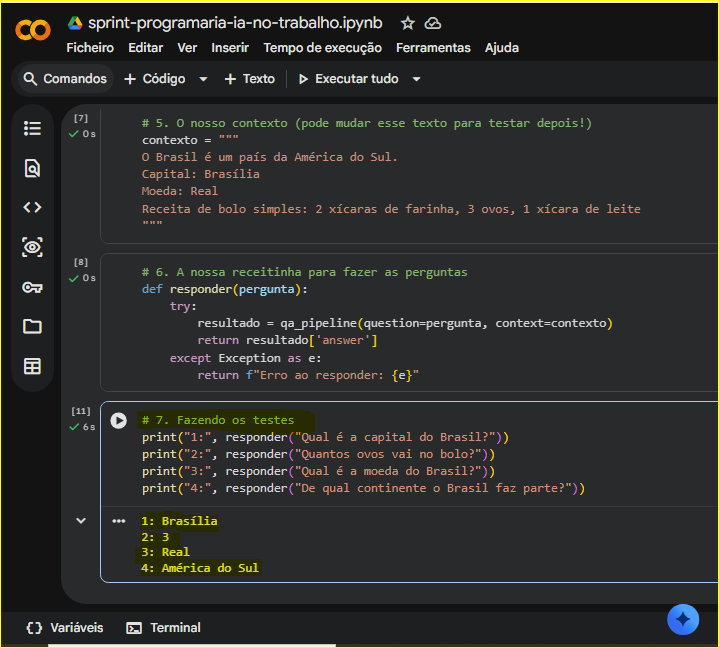

# 🤖 PrograMaria Sprint IA: Orquestrando meu Primeiro Modelo 🚀

E aí, meu 🐙! Bem-vindo(a) a mais um repositório da minha jornada como Desenvolvedora (agora também desbravando o mundo da IA)! 

Este projeto foi desenvolvido com o objetivo de colocar em prática meus estudos de Inteligência Artificial Generativa e Modelos de Linguagem (LLMs) durante a PrograMaria Sprint IA no trabalho. Aqui, apliquei e consolidei conceitos importantes de NLP (Processamento de Linguagem Natural) para criar uma aplicação inteligente, focada em extração de dados e de fácil configuração.

---

## 🎥 Veja o Projeto em Ação!

Que tal dar uma olhada no código rodando ao vivo direto na nuvem?
[Visualizar Notebook no Google Colab](https://colab.research.google.com/github/miriaamaral/sprint-programaria-ia-no-trabalho/blob/main/sprint-programaria-ia-no-trabalho.ipynb)



---

## 💡 Funcionalidades Destaque
*   **Extração de Respostas (Question-Answering):** O modelo é capaz de ler um texto de contexto fornecido e extrair respostas exatas para as perguntas feitas, mitigando o risco de "alucinações".
*   **Orquestração Manual:** Carregamento explícito das ferramentas `AutoTokenizer` (o "fatiador" de tokens) e `AutoModelForQuestionAnswering` (o cérebro) para ter total controle sobre a pipeline.
*   **Processamento em Português:** Utilização de um modelo pré-treinado especificamente para entender e responder no nosso idioma (`pierreguillou/bert-base-cased-squad-v1.1-portuguese`).
*   **Ambiente em Nuvem:** Desenvolvido e executado inteiramente no Google Colab, sem necessidade de instalações locais.

---

## 🛠 Tecnologias Utilizadas
*   **Python:** Linguagem principal utilizada para escrever os scripts, funções e lógica de interatividade.
*   **Transformers (Hugging Face):** Biblioteca utilizada para montar a linha de montagem (pipeline) de Inteligência Artificial e baixar o modelo pré-treinado.
*   **Google Colab:** Ambiente de desenvolvimento utilizado para escrever e rodar os códigos usando os servidores do Google.
*   **Git & GitHub:** Controle de versão, integração direta com o Colab e documentação.

---

## ⚙️ Como Rodar o Projeto (Localmente/Nuvem)

1.  **Clone este repositório:**
    ```bash
    git clone https://github.com/miriaamaral/sprint-programaria-ia-no-trabalho.git
    ```
2.  **Entre na pasta do projeto:**
    ```bash
    cd sprint-programaria-ia-no-trabalho
    ```

### Abra no Google Colab:

1.  **Acesse o Google Colab.**
2.  **Clique em Arquivo > Fazer upload de notebook.**
3.  **Selecione o arquivo `.ipynb` deste repositório.**

### Execute o código:

1.  **Rode as células sequencialmente** (lembrando de aceitar a instalação inicial da biblioteca transformers).

---

✉️ Contato

Vamos nos conectar e construir algo incrível juntos!

*   **[Meu LinkedIn:](https://www.linkedin.com/in/miriaamaralcs) Miriã Amaral Custódio Santos**
*   **Email:** miriaamaralcs@gmail.com
*   **Plataforma de Estudos:** Progra{M}aria
